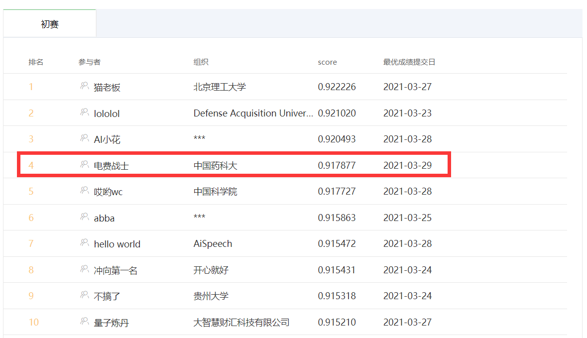

# 2021-GAIIC-Task3-Share
全球人工智能技术创新大赛-赛道三：小布助手对话短文本语义匹配

## 周星星分享
非常荣幸能够拿到周星星，目前初赛第四，本着互联网开源精神，这里也做一些的分享，和大家相互学习，共同进步。
 

## 数据
1、对偶数据增强，即Q1-Q2 pair变成Q2-Q1 pair；
 2、闭包数据增强，即Q1-Q2=1，Q2-Q3=1，则Q1-Q3=1；
 注意：数据增强时要保证正负样本比例，与原始分布一致，否则无效果甚至导致效果变差。

## 模型训练方式
### 半交互
1、ESIM， [详细介绍](https://zhuanlan.zhihu.com/p/73408108)
 2、Bimpm，[详细介绍](https://zhuanlan.zhihu.com/p/72403578)
 3、SentenceBert，[详细介绍](https://zhuanlan.zhihu.com/p/113133510)
 注意：半交互是我们一开始的思路，底层使用双路bert，上层使用bert前模型等；并且使用ESIM单模加上trick，单模也可以上0.89，但是后面使用全交互，效果更好，就没有再继续实验了。
### 全交互
1、先MLM预训练，再微调；
 2、MLM预训练与微调一起做，[苏神代码思路](https://github.com/bojone/oppo-text-match)
 注意：第二种方式会比较费时，相当于预训练和微调一起做，训练轮数需要较长，因此我们采用的是第一种预训练方式。如果你卡多，完全可以采用第二种预训练方式。

## 模型训练trick
1、全词掩码WWM，通过统计常在一起token的概率，找到全词；
 2、n-gram混合掩码，采用1、2、3-gram混合掩码；
 3、pair对数据与单句数据一起预训练；
 4、使用开源模型的权重进行模型初始化。

## 模型魔改
1、BERT模型对Sequence Output求mean pooling与cls拼接，或者加和；
 2、Multi-Dropout，[详细介绍](https://arxiv.org/pdf/1905.09788.pdf)
 3、BERT Embedding + Dense 与cls拼接；
 4、BERT 多层cls拼接或加和；
 5、BERT + GRU；
 6、BERT + HighWay；
 7、对抗学习FGM和PGD，PGD效果更好，但是耗时太久。
 注意：这里魔改都有提高，但是组合到一起反而效果变差，可能是再dev集上过拟合。目前线上使用了第1、2、4、7。组合太多了，试不过来啦。

## 模型融合
模型融合讲究和而不同，因此我们这里使用了多种模型进行融合。
 1、BERT
 2、MacBERT，[详细介绍](https://zhuanlan.zhihu.com/p/250595837)
 3、Zen，[详细介绍](https://github.com/sinovation/ZEN)
 4、XlNet
 5、UniLm，[详细介绍](https://zhuanlan.zhihu.com/p/163483660)
 6、NeZha，[详细介绍](https://zhuanlan.zhihu.com/p/100044919)
 注意：由于复赛有时间限制，我们进行了时间估算，感觉large模型无法满足时间要求，因此这里的模型使用的都是Base。
单模最佳线上能到0.906，融合之后线上目前0.917877。上大模型融合，应该会更好，但是目前还没训练出来，感觉是学习率的问题，训练到一半loss直接崩盘。

## 之前周星星的分享
AI小花：https://github.com/nilboy/reports/blob/master/gaic_track_3.md 
 ch12hu：https://github.com/chizhu/tianchi-gaic-track3-share
 lololol：https://github.com/luoda888/2021-GAIIC-phase3-idea 
 猫老板：https://gist.github.com/aloha12345x/b2b81c52dd5fee7b47e3a4eb537232f3

## 后续工作
1、预训练、微调尝试lookahead方法
 2、模型融合Stacking
 3、自蒸馏
 4、伪标签（试过一次，效果不好，找bug中）
 注意：复赛有限时，融合需谨慎。

## 联系作者
本人常在知乎分享论文、炼丹经验等，感兴趣的小伙伴可以关注我一下，知乎ID：刘聪NLP。
 打个广告，目前公司在南京（base南京）招NLP实习生，方向：语义理解、实体抽取、知识图谱、阅读理解、生成等。感兴趣的小伙伴可以给我发邮件或加我微信私聊。公司是南京云问网络技术有限公司。
* e-mail：logcongcong@gmail.com
* 知乎：[刘聪NLP](https://www.zhihu.com/people/LiuCongNLP)
* 公众号：[NLP工作站]()
 
